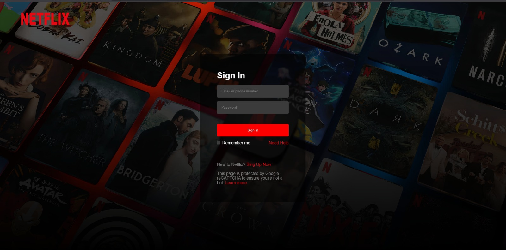

# Netflix Login Clone

Este proyecto es una réplica del login de Netflix desarrollada con React, enfocada en practicar diseño de interfaces, componentes reutilizables y estilos modernos con CSS.

---

## Preview

<p align="center">
  
</p>

---

## Tecnologías usadas

* React
* CSS3
* Vite

---

## Características

* Diseño inspirado en el login de Netflix
* Fondo con efecto tipo Netflix (overlay + imagen)
* Navbar transparente
* Formulario de login (interfaz)
* Estilos responsivos básicos
* Uso de componentes en React

---

## Estructura del proyecto

```bash
src/
│── components/
│   ├── Navbar.jsx
│   ├── Login.jsx
│  
│
│── App.jsx
│── main.jsx
│── index.css
```

---

## Instalación

1. Clona el repositorio:

```bash
git clone https://github.com/tu-usuario/netflix-login-clone.git
```

2. Entra al proyecto:

```bash
cd netflix-login-clone
```

3. Instala las dependencias:

```bash
npm install
```

4. Ejecuta el proyecto:

```bash
npm run dev
```

---

## Lo que aprendí

* Manejo de componentes en React
* Uso de `background` con `linear-gradient`
* Posicionamiento con CSS (absolute, flexbox)
* Separación de estilos por componentes
* Buenas prácticas en frontend

---

## Preview

(Aquí puedes agregar una imagen del proyecto)

---

## Notas

Este proyecto es solo con fines educativos y de práctica.
No está afiliado con Netflix.

---

## Autor

* Andres Rivera

---

## Licencia

Este proyecto es de uso libre para fines educativos.
